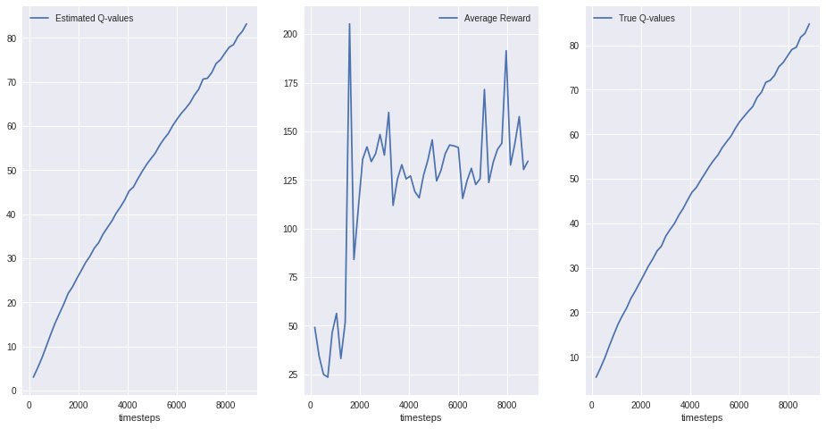
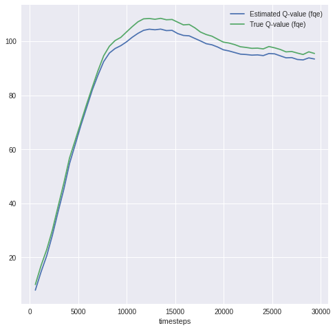

# AIPI 530: Deep Reinforcement Learning 
This repository provides access to an offline reinforcement learning implementation.

If you'd like to understand more about RL and Offline RL, please see my blog post on the topic [here](https://medium.com/@omartinez182/reinforcement-learning-for-everybody-656bedf669d9).

The code used to start the project has been forked from [d3rlpy](https://github.com/takuseno/d3rlpy), you can find more details on the citation at the bottom.
 
--- 

## Installation

1. First, you'll need to clone this repository: `git clone https://github.com/omartinez182/DeepRL`
2. Then, you need to install **pybullet** from the source, you can do that by doing:
 `pip install git+https://github.com/takuseno/d4rl-pybullet`
3. Installation of dependencies:
 `pip install Cython numpy` 
 `pip install -e`

## Getting Started 

After the installation process you can execute the file **`train_cql.py`**

   * You can specify how many  epochs like this: `python train_cql.py --epochs_cql 50 --epochs_fqe 50` 

Here's an example of how to run this using Google [Colab](https://colab.research.google.com/drive/1Srmj8vf_EOhYHC9bVDixY3PuO7H-LAas?usp=sharing)

### Example using 50 epochs:



## More Examples

For more examples, of offline reinforcement learning implementations see d3rlpy's github [repository](https://github.com/takuseno/d3rlpy).

## Citation

```
{authors:
- family-names: "Seno"
  given-names: "Takuma"
title: "d3rlpy: An offline deep reinforcement learning library"
version: 0.91
date-released: 2020-08-01
url: "https://github.com/takuseno/d3rlpy"
preferred-citation:
  type: conference-paper
  authors:
  - family-names: "Seno"
    given-names: "Takuma"
  - family-names: "Imai"
    given-names: "Michita"
  journal: "NeurIPS 2021 Offline Reinforcement Learning Workshop"
  conference:
    name: "NeurIPS 2021 Offline Reinforcement Learning Workshop"
  collection-title: "35th Conference on Neural Information Processing Systems, Offline Reinforcement Learning Workshop, 2021"
  month: 12
  title: "d3rlpy: An Offline Deep Reinforcement Learning Library"
  year: 2021
}
> https://github.com/takuseno/d3rlpy.git 
```
